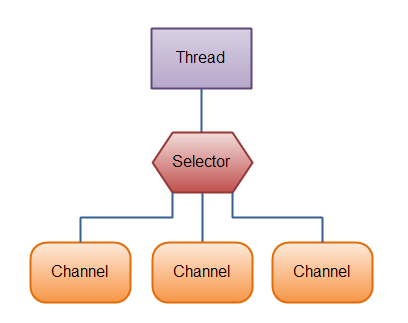
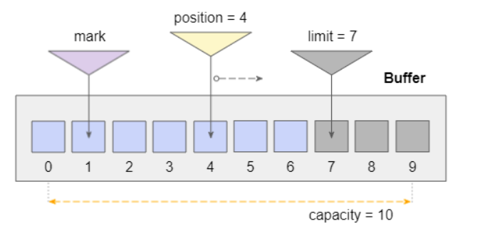
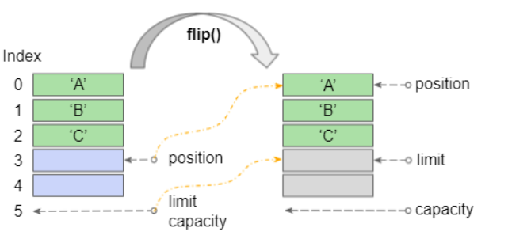

Java WebSockets
===============

# About [java.nio](https://shareprogramming.net/java-nio-cong-cu-moi-thay-the-java-io/)
Được giới thiệu trong JDK4 để thay thế cho `java.io`. Thực thi các thao tác IO với tốc độ nhanh và cung cấp nhiều tính năng hỗ trợ tối ưu hóa hiệu suất.
Hai tính năng quan trọng và nổi bật nhất của java.nio
* **Non-blocking IO operation(concurrent):** đọc dữ liệu bất cứ khi nào chúng sẵn sàng. Trong lúc chờ dữ liệu Thread có thể làm các nhiệm vụ khác làm tăng hiệu suất.
* **Buffer oriented approach:** truy cập dữ liệu sử dụng bộ nhớ đệm dữ liệu được đọc và lưu lại trong đó, bất cứ khi nào cần sẽ lấy ra và xử lý tại đây.

java.nio thực thi thông qua 2 thành phần chính:
* **Buffers:** Mỗi buffer bản chất là một vùng nhớ mà có thể đọc và ghi dữ liệu từ đó. Vùng nhớ này được bao bọc trong một NIO Buffer object, cung cấp các method hỗ trợ thao tác dữ liệu với vùng nhớ này.
* **Channel:** Gần tương đồng với Stream API, dùng để giao tác giữa giữa java.nio với bên ngoài. Với 1 channel có thể đọc, ghi dữ liệu từ 1 buffer.
* **Selector:** Một selector là một object quản lý nhiều channel khi java.nio thực thi các hoạt động non-blocking io, selector sẽ có nhiệm vụ chọn ra các channel đang sẵn sàng để thực thi nhiệm vụ.

# About [draft](https://github.com/TooTallNate/Java-WebSocket/wiki/Drafts)
Draft là 1 base class cho các class truyền tải dữ liệu trong websocket. Nó không phổ biến như handshake hay frame.

Draft_6455: implement [RFC 6455](https://www.rfc-editor.org/rfc/rfc6455)

WebSocket:
 * Sử dụng nio -> server socket: SocketServerChannel, socket client: SocketChannel.
 * Khi mỗi kết nối được thiết lập, sau handshake, server sẽ lưu socket client dưới dạng [WebSocketImpl](WebSocketImpl) để giữ kết nối với client sãn sàng cho việc trao đổi dữ liệu.
 * Data sẽ được chia thành các [FrameData](code).
 * [FrameData](code) được chia thành 2 loại chính:
   * [DataFrame](code): Lưu trữ và vận chuyển dữ liệu
     * [TextFrame](code): Dữ liệu dạng text.
     * [BinaryFrame](code): Dữ liệu dạng nhị phân (dùng để chuyển file hoặc ảnh).
   * [ControlFrame](code): Dùng để điều khiển và giữ kết nối giữa client và server
     * [PingFrame](code): ping action
     * [PongFrame](code): pong action
     * [CloseFrame](code): Yêu cầu đóng kết nối.
     * [ContinousFrame](code): Ngoại trừ frame đầu và frame cuối là không cần gửi
 

## Buffer (WebSocket truyền byte buffer)
 * Đại diện cho một bộ chứa với sức chứa (capacity) cố định để chứa các dữ liệu nguyên thủy.
 * Thường được dùng cùng với Channels. Dữ liệu sẽ được đọc từ Channel vào Buffer hoặc ghi dữ liệu từ Buffer vào Channel.

 * ### capacity: Thể hiện sức chứa của buffer.
   * Mặc dù chỉ có thể đọc hoặc ghi vào các phần tử từ chỉ số 0 đến chỉ số limit-1, nhưng nếu bạn sét limit = capacity bạn có thể truy cập (đọc, ghi) vào tất cả các phần tử của Buffer.
   * capacity(): Trả về sức chứa của buffer.
 * ### position: Thể hiện vị trí hiện của con trỏ trên buffer.
   * Cả hai hoạt động đọc và ghi đều làm con trỏ tiến về cuối của Buffer, giá trị trả về luôn nhỏ hơn hoặc bằng limit.
   * position(): trả về vị trí hiện tại của con trỏ.
   * #### 0 <= mark <= position <= limit <= capacity
   * position(int newPosition): set lại vị trí cho con trỏ.
   * newPostion phải lớn hơn hoặc bằng 0 và nhỏ hơn hoặc bằng limit.
   * Nếu newPosition < mark thì mark sẽ bị loại bỏ (discard).
 * ### limit: Thể hiện giới hạn của buffer.
   * Buffer chỉ hỗ trợ đọc và ghi vào các phần tử tại chỉ số từ 0 đến limit-1, các phần tử tại chỉ số từ limit đến capacity-1 bị vô hiệu hoá. Tuy nhiên bạn có thể sét limit = capacity để có thể truy cập (đọc hoặc ghi) vào tất cả các phần tử của Buffer.
   * limit(): trả về giới hạn của buffer.
   * limit(int newLimit): set giá trị limit mới cho buffer. newLimit phải nhỏ hơn capacity.
     * Nếu newLimit < position thì postion sẽ được sét thành newLimit.
     * Nếu newLimit < mark thì mark sẽ bị loại bỏ (discard).
 * ### mark: Đánh dấu vị trí con trỏ hiện tại.
   * mark(): được sử dụng để đánh dấu vị trí hiện tại của con trỏ. Trong quá trình thao tác với Buffer vị trí của con trỏ có thể thay đổi, gọi phương thức reset() sẽ giúp con trỏ quay trở lại ví trí đã đánh dấu trước đó.
   * mark sẽ bị loại bỏ trong các trường hợp sau:
     * Gọi phương thức setPosition(newPosition) với newPosition < mark.
     * Gọi phương thức setLimit(newLimit) với newLimit < mark.
     * Gọi phương thức clear(), rewind() hoặc flip().
 * ### reset: 
   * reset(): được sử dụng để đưa con trỏ về vị trí đã được đánh dấu trước đó. (Xem phương thức mark()).
   * có thể ném ra InvalidMarkException nếu mark không được định nghĩa hoặc đã bị loại bỏ (discard).
 * ### clear:
   * clear(): set position = 0; limit = capacity, loại bỏ (discard) mark và trả về Buffer này. Việc gọi phương thức này không ảnh hưởng tới các dữ liệu trên Buffer.
   * chuẩn bị buffer để thực hiện các thao tác channel-read hay relative put
 * ### flip: 
   * flip(): set limit = position hiện tại, position = 0 và trả về Buffer này. Và loại bỏ (discard) mark.
   * Phương thức flip() thường được sử dụng sau khi hoàn thành việc ghi dữ liệu vào Buffer. Sẵn sàng cho việc đọc ra các dữ liệu có ích trên Buffer.
   * Chuẩn bị buffer cho một chuỗi thao tác channel-write hay relative get
      
 * ### rewind
   * rewind(): được sử dụng để tua lại Buffer này, hay nói cách khác nó set position = 0, và loại bỏ (discard) mark.
   * chuẩn bị buffer để thực hiện phương thức get sau khi sử dụng phương thức put
 * ### remaining:
   * remaining(): Trả về số phần tử ở giữa position và limit-1.
 * ### hasRemaining:
   * hasRemaining(): Trả về true nếu có bất kỳ phần tử nằm giữa position và limit-1. Ngược lại trả về false.
 * ### slice:
   * slide(): Trả về một Buffer mới là ảnh chụp một phần của Buffer này. Buffer mới bao gồm các phần tử nằm giữa position và limit-1 của Buffer này. Vị trí đánh dấu (marked position) của Buffer mới không được xác định, position của Buffer mới là 0. (Xem hình minh hoạ bên dưới).
     Hai Buffer này có liên hệ với nhau, các thay đổi dữ liệu trên Buffer này sẽ được nhìn thấy trên Buffer kia và ngược lại. Các giá trị mark, position, limit, capacity của hai Buffer này là độc lập với nhau.
 * ### duplicate: 
   * duplicate(): Trả về một Buffer mới là ảnh chụp của Buffer này.
     Dữ liệu của Buffer mới sẽ là dữ liệu của Buffer này. Các thay đổi đối với dữ liệu của Buffer này sẽ hiển thị trong Buffer mới và ngược lại; các giá trị position, limit và mark của hai Buffer sẽ độc lập. Khi vừa được tạo ra, hai Buffer này có cùng các giá trị position, limit, mark.
 * ### get:
   * get(): Lấy dữ liệu từ buffer, có 2 loại:
     * relative get: lấy dữ liệu từ position hiện tại
     * bulk get: lấy một lượng dữ liệu từ position hiện tại vào một mảng array.
 * ### put: 
   * put(byte): put dữ liệu vào position hiện tại, position nhảy đến vị trí tiếp theo.
   * put(byte[]): put 1 array dữ liệu vào kể từ position hiện tại.
